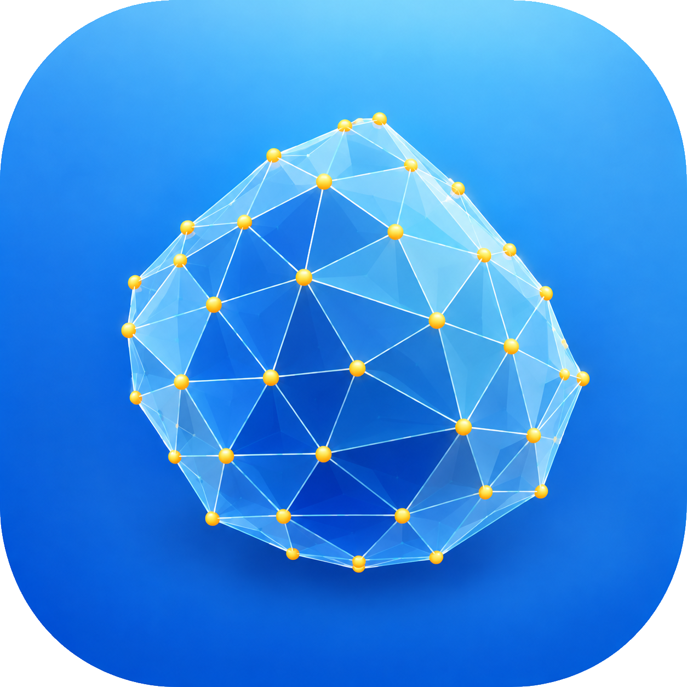

# CubatureApp

<p align="center">
  
</p>

<p align="center">
  <strong>Numerical Cubature for 3D Polyhedral Domains</strong>
</p>


**CubatureApp** è un'applicazione di calcolo scientifico per l'integrazione numerica di funzioni su domini poliedrici tridimensionali.

L'applicazione combina un'interfaccia grafica interattiva sviluppata in **Python/PySide6**, la visualizzazione 3D, il parsing simbolico delle funzioni, la validazione delle mesh, la generazione di report PDF e un **backend numerico Fortran** ad alte prestazioni che implementa il metodo di cubatura **OptimalPolyCuba3D**.

L'obiettivo principale è fornire un ambiente completo e accessibile per la cubatura numerica su geometrie tridimensionali triangolate generali, mantenendo al tempo stesso un nucleo numerico compilato adatto al calcolo scientifico, alla ricerca e alla realizzazione di esperimenti numerici riproducibili.

---

## Panoramica

L'integrazione numerica su domini tridimensionali complessi rappresenta un problema importante nel calcolo scientifico, con applicazioni nell'analisi numerica, nella geometria computazionale, nei metodi agli elementi finiti, nella fisica computazionale e nell'ingegneria.

CubatureApp fornisce un flusso di lavoro integrato per:

- caricare mesh poliedriche tridimensionali;
- validare e analizzare i dati geometrici;
- visualizzare interattivamente il dominio;
- definire la funzione da integrare;
- selezionare il grado di esattezza desiderato;
- costruire una regola di cubatura ottimale;
- visualizzare i punti di cubatura;
- calcolare integrali numerici;
- analizzare informazioni e statistiche relative al calcolo;
- esportare i risultati e generare report PDF.

L'interfaccia grafica è implementata in **Python**, mentre le routine numeriche ad alta intensità computazionale sono implementate in **Fortran**.

---

## Funzionalità principali

### Domini poliedrici 3D

CubatureApp lavora con domini rappresentati mediante mesh superficiali triangolari chiuse.

La geometria è descritta attraverso:

- vertici;
- facce triangolari;
- connettività tra vertici e facce.

Il formato di input attualmente utilizzato è una rappresentazione `.dat`.

### Visualizzazione 3D interattiva

L'applicazione include un visualizzatore 3D interattivo basato sull'ecosistema **VTK/PyVista**.

È possibile visualizzare:

- la mesh di input;
- il bordo triangolato;
- i punti di cubatura;
- la distribuzione spaziale della regola risultante.

La geometria può quindi essere analizzata direttamente all'interno dell'applicazione senza la necessità di utilizzare software esterni per la visualizzazione.

### Parser delle funzioni

L'integranda può essere inserita direttamente attraverso l'interfaccia grafica utilizzando il linguaggio LaTeX.

Il parser delle funzioni si basa sull'elaborazione simbolica anziché sull'esecuzione arbitraria di espressioni Python, fornendo un meccanismo più sicuro e strutturato per convertire le espressioni matematiche definite dall'utente in funzioni numeriche.

### Validazione della mesh

Prima di eseguire un calcolo di cubatura, l'applicazione può verificare la geometria di input.

Il processo di validazione comprende controlli relativi a:

- leggibilità dei file;
- numero corretto di vertici e facce;
- connettività delle facce triangolari;
- validità degli indici dei vertici;
- coordinate numeriche finite;
- informazioni relative al bounding box geometrico;
- presenza di dati geometrici potenzialmente problematici o duplicati.

La validazione della mesh è particolarmente importante poiché il metodo numerico si basa su una rappresentazione coerente del bordo del dominio.

---

## Architettura

CubatureApp segue un'architettura a livelli che separa l'interfaccia grafica, la gestione della geometria, la visualizzazione, l'elaborazione delle funzioni e il calcolo numerico.

```text
                         CubatureApp
                              │
                              ▼
                    ┌──────────────────┐
                    │ Interfaccia GUI  │
                    │      PySide6     │
                    └────────┬─────────┘
                             │
             ┌───────────────┼────────────────┐
             │               │                │
             ▼               ▼                ▼
        Gestione          Parser delle    Visualizzazione
        geometria           funzioni          PyVista
             │               │                │
             └───────────────┼────────────────┘
                             ▼
                      Motore di cubatura
                             │
                             ▼
                    Backend Fortran
                             │
                             ▼
                    OptimalPolyCuba3D
                             │
                             ▼
                  Punti e pesi di cubatura
                             │
                             ▼
                         Risultati
```

Questa separazione consente all'interfaccia grafica e al backend numerico di evolvere indipendentemente, mantenendo al tempo stesso isolato il nucleo computazionale dal livello di presentazione.

---

## Struttura del repository

```text
CubatureApp/
├── app/
│   ├── __init__.py
│   ├── __main__.py
│   ├── main.py
│   ├── report_pdf.py
│   ├── version.py
│   │
│   ├── assets/
│   │   ├── cubature_icon.ico
│   │   ├── cubature_icon.png
│   │   ├── cubature_icon.svg
│   │   └── CubatureApp.icns
│   │
│   ├── config/
│   │   ├── __init__.py
│   │   └── settings.py
│   │
│   ├── core/
│   │   ├── __init__.py
│   │   ├── cubature_engine.py
│   │   └── fortran_backend.py
│   │
│   ├── function_parser/
│   │   ├── __init__.py
│   │   └── parser.py
│   │
│   ├── geometry/
│   │   ├── __init__.py
│   │   ├── mesh_io.py
│   │   └── mesh_validation.py
│   │
│   ├── gui/
│   │   ├── __init__.py
│   │   ├── export_dialog.py
│   │   ├── input_panel.py
│   │   ├── main_window.py
│   │   ├── results_panel.py
│   │   └── style.py
│   │
│   └── visualization/
│       ├── __init__.py
│       └── viewer3d.py
│
├── build.py
│
├── examples/
│   ├── bunny_tri.dat
│   ├── bunny_vertex.dat
│   ├── concave_tri.dat
│   ├── concave_vertex.dat
│   ├── convex_tri.dat
│   └── convex_vertex.dat
│
├── fortran/
│   └── src/
│       ├── CubaCheap.f90
│       ├── driverCLI.f90
│       ├── OptimalPolyCuba3D.f90
│       ├── PolyhedronMesh.f90
│       ├── PrepCheap.f90
│       ├── triangleQuadratureGJ.f90
│       └── TypesDef.f90
│
├── installer/
│   └── create_macos_dmg.sh
│
├── LICENSE
├── README.md
├── requirements.txt
└── requirements-build.txt
```

---

## Requisiti

CubatureApp è sviluppata principalmente e testata su **macOS**, sebbene l'architettura sia progettata per rimanere portabile su altre piattaforme dotate degli strumenti Python e Fortran necessari.

### Python

È consigliata un'installazione recente di Python 3.

```bash
python3 --version
```

È fortemente consigliato utilizzare un ambiente virtuale.

### Fortran

Il backend numerico richiede un compilatore Fortran.

Su macOS, il compilatore consigliato è **gfortran**:

```bash
gfortran --version
```

Se necessario, `gfortran` può essere installato tramite un gestore di pacchetti come Homebrew.

---

## Installazione

Clonare il repository e accedere alla directory del progetto:

```bash
git clone <repository-url>
cd CubatureApp
```

Creare e attivare un ambiente virtuale:

```bash
python3 -m venv .venv
source .venv/bin/activate
```

Installare le dipendenze dell'applicazione:

```bash
pip install -r requirements.txt
```

Per le operazioni di sviluppo e compilazione:

```bash
pip install -r requirements-build.txt
```

---

## Compilazione del backend numerico

Il nucleo numerico è implementato in Fortran ed è separato dall'interfaccia grafica Python.

I file sorgente si trovano in:

```text
fortran/src/
```

L'implementazione numerica principale è contenuta in:

```text
OptimalPolyCuba3D.f90
```

L'interfaccia a riga di comando è fornita da:

```text
driverCLI.f90
```

Gli altri moduli forniscono funzionalità di supporto per la gestione delle mesh, la valutazione dei polinomi, il calcolo dei momenti, la quadratura triangolare, la costruzione delle regole di cubatura e il pre-processing numerico.

Il sistema di compilazione Python è fornito da:

```text
build.py
```

Per compilare il backend numerico:

```bash
python build.py
```

Se `gfortran` non viene trovato, verificarne l'installazione con:

```bash
which gfortran
gfortran --version
```

---

## Avvio di CubatureApp

Dopo aver installato le dipendenze e compilato il backend numerico, avviare l'applicazione dalla directory principale del repository:

```bash
python -m app
```

In alternativa:

```bash
python -m app.main
```

Si consiglia di avviare l'applicazione dalla directory principale del repository, in modo che la struttura del pacchetto Python e le risorse relative vengano risolte correttamente.

---

## Formato della mesh di input

CubatureApp utilizza attualmente un formato `.dat` leggero per le mesh superficiali triangolari.

Il file dei vertici contiene il numero di vertici seguito dalle rispettive coordinate tridimensionali:

```text
N
x1 y1 z1
...
xN yN zN
```

Il file delle facce contiene il numero di facce triangolari seguito dagli indici dei relativi vertici:

```text
M
i1 j1 k1
...
iM jM kM
```

Gli indici delle facce devono fare riferimento a vertici validi presenti nel corrispondente file dei vertici.

Esempi di mesh sono disponibili nella directory `examples/`.

---

## Risoluzione dei problemi

### `ModuleNotFoundError: No module named 'app'`

Avviare l'applicazione dalla directory principale del repository:

```bash
cd CubatureApp
python -m app
```

Evitare di avviare i moduli del pacchetto dall'interno della directory `app/`.

### Dipendenze Python mancanti

Assicurarsi che l'ambiente virtuale sia attivo:

```bash
source .venv/bin/activate
```

Quindi reinstallare le dipendenze:

```bash
pip install -r requirements.txt
```

### `gfortran` non trovato

Verificare che il compilatore sia disponibile:

```bash
which gfortran
gfortran --version
```

Se non viene trovato alcun compilatore, installare e configurare un compilatore Fortran appropriato prima di compilare il backend numerico.

### Il calcolo della cubatura non va a buon fine

Verificare che:

1. il backend Fortran sia stato compilato correttamente;
2. l'eseguibile o la libreria del backend si trovi nella posizione prevista dalla configurazione Python;
3. la mesh selezionata sia valida;
4. tutti gli indici dei vertici siano compresi nell'intervallo consentito;
5. la mesh contenga facce triangolari;
6. l'espressione matematica sia valida;
7. il grado di esattezza selezionato sia supportato dalla configurazione corrente del backend.

### Mesh non valida

Verificare che i file `.dat` rispettino il formato richiesto e che tutti gli indici delle facce facciano riferimento a vertici esistenti.

---

## Licenza

CubatureApp è distribuita secondo la licenza specificata nel file:

```text
LICENSE
```

Per le condizioni complete di utilizzo, consultare tale file.

---

## Citazione

Se CubatureApp o il metodo numerico alla base del progetto vengono utilizzati in un lavoro accademico, si prega di citare il progetto e la relativa documentazione scientifica.

---

**CubatureApp — Cubatura numerica per domini poliedrici tridimensionali**
